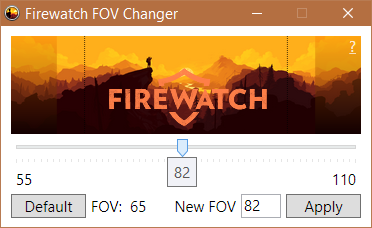

# Change FOV in [Firewatch](http://www.firewatchgame.com/) 

Download zip archive with executable file in [Releases](https://github.com/beatcracker/firewatch-fov-changer/releases) section.

# Details

Default FOV in Firewatch is `55`, which is quite low for the most of the users. This app allows you to change FOV by modifying Firewatch settings in registry.

You can also [do this manually](http://steamcommunity.com/app/383870/discussions/1/412446292776350214):

* Open up the registry editor by typing `regedit.exe` into your Windows search bar. 

* Navigate your registry to the following key:
  `HKEY_CURRENT_USER\Software\CampoSanto\Firewatch\fovAdjust_h2041137991`

* Right click on `fovAdjust_h2041137991` and choose `Modify`. Set the base to be `Decimal`.

* Set the value to be `100` times the amount you want to adjust the FOV by. For example, if you wanted the FOV to be `90` you need to increase the FOV by `35`. So the value of `fovAdjust_h2041137991` should be `3500` (35 * 100).
